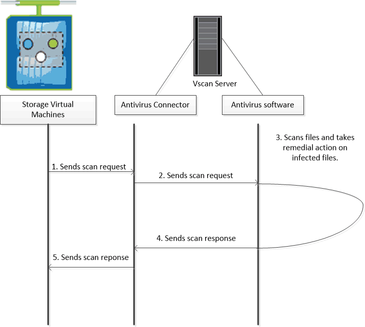

= Informazioni sulla scansione dei virus NetApp
:allow-uri-read: 
:icons: font
:imagesdir: ../media/

[role="lead"]
È possibile utilizzare la funzionalità antivirus integrata nei sistemi di storage NetApp per proteggere i dati da virus o altri codici dannosi. La scansione dei virus NetApp, denominata _Vscan_, combina il software antivirus di terze parti migliore del settore con le funzionalità ONTAP che offrono la flessibilità necessaria per controllare quali file vengono sottoposti a scansione e quando.

== Come funziona la scansione virus

I sistemi storage trasferiscono le operazioni di scansione a server esterni che ospitano software antivirus di terze parti. Il connettore antivirus ONTAP, fornito da NetApp e installato sul server esterno, gestisce la comunicazione tra il sistema di storage e il software antivirus.

* È possibile utilizzare _on-access scanning_ per verificare la presenza di virus quando i client aprono, leggono, rinominano o chiudono i file su SMB. L'operazione sul file viene sospesa fino a quando il server esterno non riporta lo stato di scansione del file. Se il file è già stato sottoposto a scansione, ONTAP consente l'operazione. In caso contrario, richiede una scansione dal server.
+
La scansione on-access non è supportata per NFS.

* È possibile utilizzare la _scansione on-demand_ per controllare i file alla ricerca di virus immediatamente o in base a una pianificazione. Ad esempio, è possibile eseguire scansioni solo in ore non di punta. Il server esterno aggiorna lo stato di scansione dei file selezionati, in modo che la latenza di accesso ai file (presupponendo che non siano stati modificati) sia in genere ridotta al successivo accesso tramite SMB.
+
È possibile utilizzare la scansione on-demand per qualsiasi percorso nello spazio dei nomi SVM, anche per i volumi esportati solo tramite NFS.

In genere, si abilitano entrambe le modalità di scansione su una SVM. In entrambe le modalità, il software antivirus esegue un'azione correttiva sui file infetti in base alle impostazioni del software.

