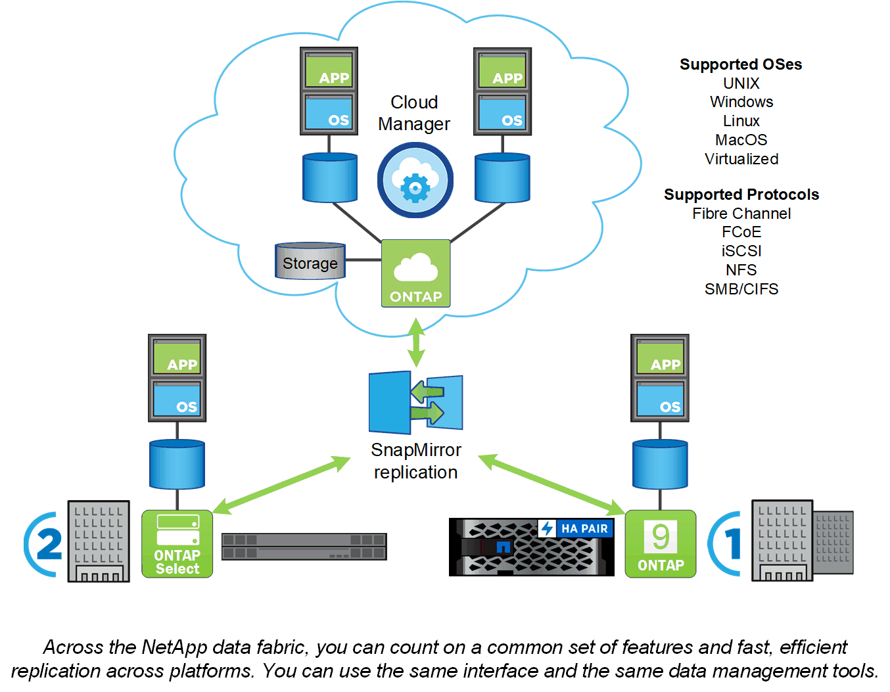

= Piattaforme ONTAP
:allow-uri-read: 
:icons: font
:imagesdir: ../media/

[role="lead"]
Il software per la gestione dei dati ONTAP offre storage unificato per le applicazioni che leggono e scrivono i dati su protocolli di accesso a blocchi o file, in configurazioni storage che spaziano dalla flash ad alta velocità, ai supporti rotanti a basso prezzo, allo storage a oggetti basato sul cloud.

Le implementazioni ONTAP vengono eseguite su appliance FAS o AFF progettate da NetApp, su hardware commodity (ONTAP Select) e in cloud privati, pubblici o ibridi (storage privato NetApp o Cloud Volumes ONTAP). Le implementazioni specializzate offrono un'infrastruttura convergente Best-in-class (FlexPod Datacenter) e l'accesso a storage array di terze parti (virtualizzazione FlexArray).

Insieme, queste implementazioni formano il framework di base del _data fabric NetApp_, con un approccio comune software-defined alla gestione dei dati e una replica rapida ed efficiente tra le piattaforme.

.Informazioni su FlexPod Datacenter e virtualizzazione FlexArray
Sebbene non sia rappresentato nell'illustrazione del data fabric NetApp, FlexPod Datacenter e la virtualizzazione FlexArray sono implementazioni chiave di ONTAP:

* FlexPod integra i componenti di storage, networking e calcolo Best-in-class in un'architettura flessibile per i carichi di lavoro aziendali. La sua infrastruttura convergente accelera l'implementazione di applicazioni business-critical e infrastrutture di data center basate sul cloud.
* FlexArray è un front-end per gli array di storage di terze parti e NetApp e-Series, che offre un set uniforme di funzionalità e una gestione dei dati ottimizzata. Un sistema FlexArray assomiglia a qualsiasi altro sistema ONTAP e offre tutte le stesse funzionalità.

