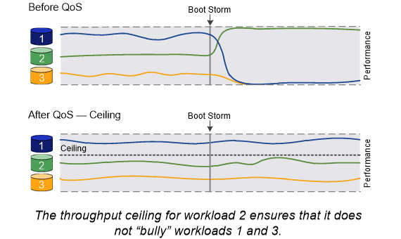
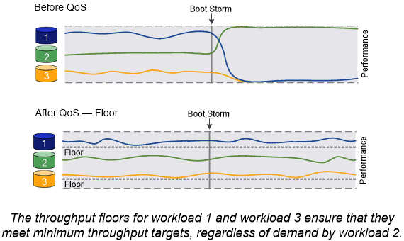

= Bilanciamento del carico
:allow-uri-read: 
:icons: font
:imagesdir: ../media/

[role="lead"]
Le performance dei carichi di lavoro iniziano ad essere influenzate dalla latenza quando la quantità di lavoro su un nodo supera le risorse disponibili. È possibile gestire un nodo sovraccarico aumentando le risorse disponibili (aggiornamento di dischi o CPU) o riducendo il carico (spostamento di volumi o LUN in nodi diversi in base alle necessità).

È inoltre possibile utilizzare ONTAP _qualità del servizio (QoS) dello storage_ per garantire che le performance dei carichi di lavoro critici non vengano degradate da carichi di lavoro concorrenti:

* È possibile impostare un _soffitto_ di throughput QoS su un carico di lavoro concorrente per limitarne l'impatto sulle risorse di sistema (QoS Max).
* È possibile impostare un _floor_ di throughput QoS per un carico di lavoro critico, garantendo che soddisfi gli obiettivi di throughput minimi indipendentemente dalla domanda mediante carichi di lavoro concorrenti (QoS min).
* È possibile impostare un tetto e un piano QoS per lo stesso carico di lavoro.

== Limiti di throughput

Un limite massimo di throughput limita il throughput per un carico di lavoro a un numero massimo di IOPS o MB/s. Nella figura seguente, il limite massimo di throughput per il carico di lavoro 2 garantisce che non vengano utilizzati i carichi di lavoro 1 e 3 "`bully`".

Un _gruppo di policy_ definisce il limite massimo di throughput per uno o più carichi di lavoro. Un carico di lavoro rappresenta le operazioni di i/o per un _oggetto storage:_ volume, file o LUN o tutti i volumi, file o LUN di una SVM. È possibile specificare il limite massimo quando si crea il gruppo di criteri oppure attendere che i carichi di lavoro vengano monitorati per specificarlo.

[NOTE]
====
Il throughput per i carichi di lavoro potrebbe superare il limite massimo specificato fino al 10%, soprattutto se un carico di lavoro subisce rapidi cambiamenti nel throughput. Il limite massimo potrebbe essere superato fino al 50% per gestire i burst.

====

== Piani di throughput

Un piano di throughput garantisce che il throughput per un carico di lavoro non scenda al di sotto di un numero minimo di IOPS. Nella figura riportata di seguito, i livelli di throughput per il carico di lavoro 1 e il carico di lavoro 3 garantiscono il raggiungimento degli obiettivi di throughput minimi, indipendentemente dalla domanda per carico di lavoro 2.

[TIP]
====
Come suggeriscono gli esempi, un limite di throughput rallenta direttamente il throughput. Un piano di throughput rallenta indirettamente il throughput, dando priorità ai carichi di lavoro per i quali è stato impostato il piano.

====
Un carico di lavoro rappresenta le operazioni di i/o di un volume, LUN o, a partire da ONTAP 9.3, file. Un gruppo di criteri che definisce un piano di throughput non può essere applicato a una SVM. È possibile specificare il piano di lavoro quando si crea il gruppo di policy oppure attendere fino a quando non si monitorano i carichi di lavoro per specificarlo.

[NOTE]
====
Il throughput di un carico di lavoro potrebbe scendere al di sotto del piano specificato se la capacità delle performance (spazio di crescita) sul nodo o sull'aggregato è insufficiente o durante operazioni critiche come `volume move trigger-cutover`. Anche quando è disponibile una capacità sufficiente e non si svolgono operazioni critiche, il throughput di un workload potrebbe scendere al di sotto del piano specificato fino al 5%.

====

== QoS adattiva

Normalmente, il valore del gruppo di criteri assegnato a un oggetto di storage è fisso. È necessario modificare il valore manualmente quando la dimensione dell'oggetto di storage cambia. Un aumento della quantità di spazio utilizzata su un volume, ad esempio, richiede solitamente un aumento corrispondente del limite di throughput specificato per il volume.

_QoS adattiva_ scala automaticamente il valore del gruppo di policy in base alle dimensioni del carico di lavoro, mantenendo il rapporto tra IOPS e TB|GB in base alle dimensioni del carico di lavoro. Si tratta di un vantaggio significativo quando si gestiscono centinaia o migliaia di carichi di lavoro in un'implementazione di grandi dimensioni.

In genere, si utilizza la QoS adattiva per regolare i limiti di throughput, ma è anche possibile utilizzarla per gestire i piani di throughput (quando le dimensioni del carico di lavoro aumentano). La dimensione del carico di lavoro viene espressa come spazio allocato per l'oggetto di storage o come spazio utilizzato dall'oggetto di storage.

NOTE: Lo spazio utilizzato è disponibile per i piani di throughput in ONTAP 9.5 e versioni successive. Non è supportato per i piani di throughput in ONTAP 9.4 e versioni precedenti.

A partire da ONTAP 9.13.1, è possibile utilizzare la QoS adattiva per impostare i livelli e i limiti di throughput a livello di SVM.

* Una policy di _spazio allocato_ mantiene il rapporto IOPS/TB|GB in base alle dimensioni nominali dell'oggetto di storage. Se il rapporto è di 100 IOPS/GB, un volume da 150 GB avrà un limite di throughput di 15,000 IOPS, a condizione che il volume rimanga tale. Se il volume viene ridimensionato a 300 GB, la QoS adattiva regola il limite di throughput a 30,000 IOPS.
* Una policy _used space_ (predefinita) mantiene il rapporto IOPS/TB|GB in base alla quantità di dati effettivi memorizzati prima dell'efficienza dello storage. Se il rapporto è di 100 IOPS/GB, un volume da 150 GB con 100 GB di dati memorizzati avrebbe un limite massimo di throughput di 10,000 IOPS. Man mano che la quantità di spazio utilizzato cambia, la QoS adattiva regola il limite di throughput in base al rapporto.

