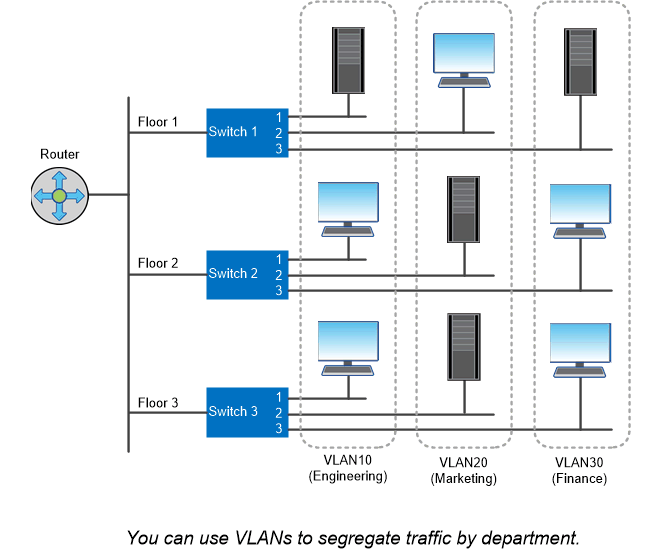

= Porte logiche
:allow-uri-read: 
:icons: font
:imagesdir: ../media/

[role="lead"]
Oltre alle porte fisiche fornite su ciascun nodo, è possibile utilizzare _porte logiche_ per gestire il traffico di rete. Le porte logiche sono gruppi di interfacce o VLAN.

== Gruppi di interfacce

_Gruppi di interfacce_ combina più porte fisiche in una singola "`porta trunk`" logica. È possibile creare un gruppo di interfacce costituito da porte provenienti da NIC in slot PCI diversi per evitare un errore di slot che riduce il traffico business-critical.

Un gruppo di interfacce può essere monomodale, multimodale o multimodale dinamica. Ogni modalità offre diversi livelli di tolleranza agli errori. Per bilanciare il carico del traffico di rete, è possibile utilizzare entrambi i tipi di gruppo di interfacce multimodali.

== VLAN

_VLAN_ separa il traffico da una porta di rete (che potrebbe essere un gruppo di interfacce) in segmenti logici definiti in base alla porta dello switch, piuttosto che in base ai confini fisici. Le _stazioni finali_ appartenenti a una VLAN sono correlate in base alla funzione o all'applicazione.

È possibile raggruppare le stazioni finali per reparto, ad esempio Engineering and Marketing, o per progetto, ad esempio release1 e release2. Poiché la prossimità fisica delle stazioni finali è irrilevante in una VLAN, le stazioni finali possono essere geograficamente remote.

