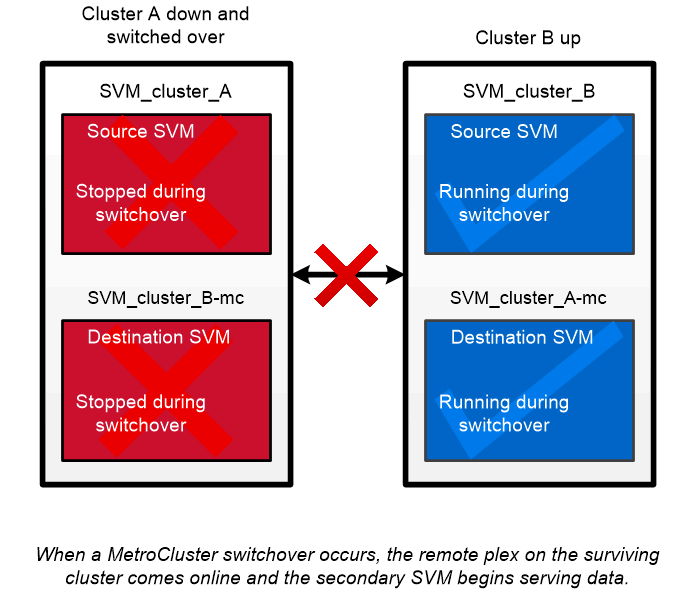

= Disponibilità continua di MetroCluster
:hardbreaks:
:allow-uri-read: 
:icons: font
:imagesdir: ../media/

[role="lead"]
Le configurazioni MetroCluster proteggono i dati implementando due cluster fisicamente separati con mirroring. Ciascun cluster replica in modo sincrono i dati e la configurazione SVM dell'altro. In caso di disastro in un sito, un amministratore può attivare la SVM mirrorata e iniziare a fornire i dati dal sito sopravvissuto.

* Le configurazioni _Fabric-attached MetroCluster_ supportano cluster a livello metropolitano.
* Le configurazioni _stretch MetroCluster_ supportano cluster a livello di campus.

In entrambi i casi, i cluster devono essere peering.

MetroCluster utilizza una funzionalità di ONTAP denominata _SyncMirror_ per eseguire il mirroring sincrono dei dati aggregati per ciascun cluster nelle copie, o _plex_, nello storage dell'altro cluster. Se si verifica uno switchover, il plex remoto sul cluster in uso viene online e la SVM secondaria inizia a fornire i dati.

|===

 a| 
*_utilizzo di SyncMirror in implementazioni non MetroCluster_* è possibile utilizzare SyncMirror in un'implementazione non MetroCluster per proteggere dalla perdita di dati in caso di guasti di più dischi rispetto a quelli protetti dal tipo RAID o in caso di perdita di connettività ai dischi del gruppo RAID. La funzione è disponibile solo per le coppie ha.

I dati aggregati vengono mirrorati in plessi memorizzati su diversi shelf di dischi. Se uno degli shelf non è disponibile, il plesso non interessato continua a fornire dati mentre si corregge la causa del guasto.

Tenere presente che un aggregato mirrorato utilizzando SyncMirror richiede il doppio dello storage rispetto a un aggregato senza mirror. Ogni plex richiede un numero di dischi pari a quello del plex che esegue il mirroring. Per eseguire il mirroring di un aggregato da 1,440 GB, ad esempio 1,440 GB per ciascun plex, sono necessari 2,880 GB di spazio su disco.

[NOTE]
====
SyncMirror è disponibile anche per le implementazioni della virtualizzazione FlexArray.

====
|===