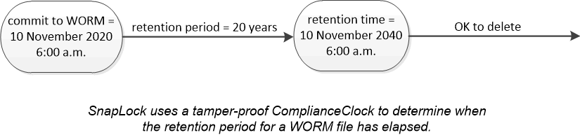

= Storage WORM
:allow-uri-read: 
:icons: font
:imagesdir: ../media/

[role="lead"]
_SnapLock_ è una soluzione per la compliance dalle performance elevate per le organizzazioni che utilizzano lo storage _write once, Read Many (WORM)_ per conservare i file critici in forma non modificata per scopi normativi e di governance.

Una singola licenza consente di utilizzare SnapLock in una _modalità di conformità_ rigorosa, per soddisfare mandati esterni come la norma SEC 17a-4, e una _modalità aziendale_ più allentata, per soddisfare le normative interne per la protezione delle risorse digitali. SnapLock utilizza un _ComplianceClock_ a prova di manomissione per determinare quando è trascorso il periodo di conservazione di un file WORM.

È possibile utilizzare _SnapLock for SnapVault_ per proteggere WORM le copie Snapshot sullo storage secondario. È possibile utilizzare SnapMirror per replicare i file WORM in un'altra posizione geografica per il disaster recovery e altri scopi.

