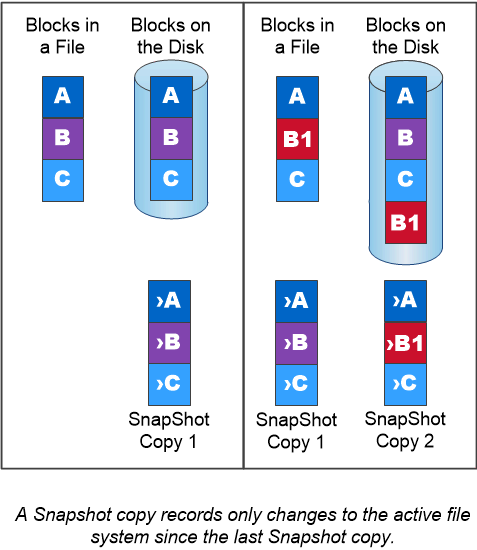

= Copie Snapshot
:allow-uri-read: 
:icons: font
:imagesdir: ../media/

[role="lead"]
Tradizionalmente, le tecnologie di replica di ONTAP servivano per il disaster recovery (DR) e l'archiviazione dei dati. Con l'avvento dei servizi cloud, la replica di ONTAP è stata adattata al trasferimento dei dati tra endpoint nel data fabric NetApp. La base per tutti questi utilizzi è la tecnologia Snapshot di ONTAP.

Una _copia Snapshot_ è un'immagine point-in-time di sola lettura di un volume. Dopo aver creato una copia Snapshot, il file system attivo e la copia Snapshot puntano agli stessi blocchi di disco; pertanto, la copia Snapshot non utilizza spazio su disco aggiuntivo. Con il passare del tempo, l'immagine consuma uno spazio di storage minimo e subisce un overhead delle performance trascurabile in quanto registra solo le modifiche ai file dall'ultima copia Snapshot.

Le copie Snapshot devono la loro efficienza alla tecnologia di virtualizzazione dello storage di base di ONTAP, il suo _Write Anywhere file Layout (WAFL)._ come un database, WAFL utilizza i metadati per puntare ai blocchi di dati effettivi sul disco. Tuttavia, a differenza di un database, WAFL non sovrascrive i blocchi esistenti. Scrive i dati aggiornati in un nuovo blocco e cambia i metadati.

Le copie Snapshot sono efficienti perché, al contrario, vengono utilizzati blocchi di dati di copia, mentre ONTAP fa riferimento ai metadati durante la creazione di una copia Snapshot. In questo modo si eliminano sia il tempo di ricerca che altri sistemi incorrono nell'individuazione dei blocchi da copiare, sia il costo della copia stessa.

È possibile utilizzare una copia Snapshot per ripristinare singoli file o LUN o per ripristinare l'intero contenuto di un volume. ONTAP confronta le informazioni del puntatore nella copia Snapshot con i dati su disco per ricostruire l'oggetto mancante o danneggiato, senza downtime o costi di performance significativi.

Una _policy Snapshot_ definisce il modo in cui il sistema crea le copie Snapshot dei volumi. Il criterio specifica quando creare le copie Snapshot, quante copie conservare, come assegnarle un nome e come etichettarle per la replica. Ad esempio, un sistema potrebbe creare una copia Snapshot ogni giorno alle 12:10, conservare le due copie più recenti, chiamarle "`daily`" (con data e ora) ed etichettarle "`daily`" per la replica.

