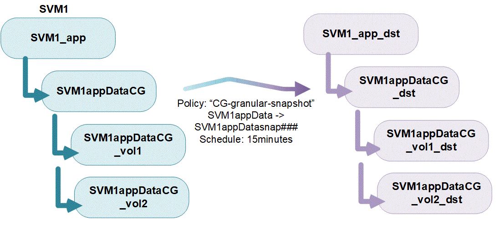

= Panoramica dei gruppi di coerenza
:allow-uri-read: 
:icons: font
:imagesdir: ../media/

[role="lead"]
Un gruppo di coerenza è un insieme di volumi gestiti come singola unità. In ONTAP, i gruppi di coerenza offrono una gestione semplice e una garanzia di protezione per un carico di lavoro applicativo che copre più volumi.

È possibile utilizzare gruppi di coerenza per semplificare la gestione dello storage. Immaginate di disporre di un database importante che comprende venti LUN. È possibile gestire le LUN su base individuale o trattare le LUN come un dataset solitario, organizzandole in un singolo gruppo di coerenza.

I gruppi di coerenza facilitano la gestione del carico di lavoro dell'applicazione, fornendo policy di protezione locali e remote facilmente configurabili e copie Snapshot simultanee coerenti con il crash o coerenti con l'applicazione di una raccolta di volumi in un momento specifico. Le snapshot nei gruppi di coerenza consentono di ripristinare un intero carico di lavoro dell'applicazione.

== Comprendere i gruppi di coerenza

I gruppi di coerenza supportano qualsiasi volume FlexVol indipendentemente dal protocollo (NAS, SAN o NVMe) e possono essere gestiti tramite l'API REST di ONTAP o in Gestione sistema nella voce di menu *Storage > Consistency Groups*.

I gruppi di coerenza possono esistere come singole entità, come un insieme di volumi, o in una relazione gerarchica, che consiste di altri gruppi di coerenza. I singoli volumi possono disporre di una propria policy di snapshot granulare per i volumi. Inoltre, è possibile creare una policy di snapshot coerente a livello di gruppo. Il gruppo di coerenza può avere solo una relazione di continuità aziendale SnapMirror (SM-BC) e una policy condivisa SM-BC, che possono essere utilizzate per ripristinare l'intero gruppo di coerenza.

Il seguente diagramma illustra come utilizzare un singolo gruppo di coerenza. I dati di un'applicazione ospitata su `SVM1` si estende su due volumi: `vol1` e. `vol2`. Una policy Snapshot sul gruppo di coerenza acquisisce snapshot dei dati ogni 15 minuti.

I carichi di lavoro delle applicazioni più grandi potrebbero richiedere più gruppi di coerenza. In queste situazioni, è possibile creare gruppi di coerenza gerarchici, in cui un singolo gruppo di coerenza diventa i componenti secondari di un gruppo di coerenza padre. Il gruppo di coerenza padre può includere fino a cinque gruppi di coerenza figlio. Come nei singoli gruppi di coerenza, è possibile applicare una policy di protezione remota SM-BC all'intera configurazione dei gruppi di coerenza (padre e figlio) per ripristinare il carico di lavoro dell'applicazione.

Nell'esempio seguente, un'applicazione è ospitata su `SVM1`. L'amministratore ha creato un gruppo di coerenza principale, `SVM1_app`, che include due gruppi di coerenza figlio: `SVM1appDataCG` per i dati e. `SVM1app_logCG` per i log. Ogni gruppo di coerenza figlio dispone di una propria policy di snapshot. Snapshot dei volumi in `SVM1appDataCG` ogni 15 minuti. Snapshot di `SVM1app_logCG` vengono presi ogni ora. Il gruppo di coerenza padre `SVM1_app` Dispone di una policy SM-BC che replica i dati per garantire un servizio continuo in caso di disastro.

image:../media/consistency-group-nested-diagram.gif["Diagramma di un gruppo di coerenza nidificato con i volumi associati"]

A partire da ONTAP 9.12.1, il supporto dei gruppi di coerenza xref:clone-task.html[cloning] e modificando i membri della coerenza con xref:modify-task.html[aggiunta o rimozione di volumi] In Gestione di sistema e nell'API REST di ONTAP. A partire da ONTAP 9.12.1, l'API REST di ONTAP supporta anche:

* Creazione di gruppi di coerenza con nuovi volumi NFS o SMB o spazi dei nomi NVMe.
* Aggiunta di volumi NFS o SMB nuovi o esistenti o spazi dei nomi NVMe a gruppi di coerenza esistenti.

Per ulteriori informazioni sull'API REST di ONTAP, fare riferimento a. https://docs.netapp.com/us-en/ontap-automation/reference/api_reference.html#access-a-copy-of-the-ontap-rest-api-reference-documentation["Documentazione di riferimento API REST di ONTAP"].

== Monitorare i gruppi di coerenza

A partire da ONTAP 9.13.1, i gruppi di coerenza offrono il monitoraggio storico e in tempo reale della capacità e delle performance, offrendo informazioni sulle performance delle applicazioni e dei singoli gruppi di coerenza.

I dati di monitoraggio dei gruppi di coerenza vengono mantenuti per un massimo di un anno. Puoi tenere traccia delle metriche per:

* Performance: IOPS, latenza e throughput
* Capacità: Dimensioni, capacità disponibile, capacità utilizzata

NOTE: È possibile recuperare le metriche storiche solo con L'API REST. Le metriche storiche non sono visualizzabili in System Manager.

== Proteggere i gruppi di coerenza

I gruppi di coerenza offrono protezione attraverso:

* Policy di Snapshot
* xref:../smbc/index.html[Continuità aziendale SnapMirror (SM-BC)]
* <<mcc>> (inizio 9.11.1)
* xref:../data-protection/snapmirror-disaster-recovery-concept.html[SnapMirror asincrono] (inizio 9.13.1)

La creazione di un gruppo di coerenza non attiva automaticamente la protezione. È possibile impostare policy di protezione locali e remote durante la creazione o dopo la creazione di un gruppo di coerenza.

Per configurare la protezione su un gruppo di coerenza, vedere link:protect-task.html["Proteggere un gruppo di coerenza"].

Per utilizzare la protezione remota, è necessario soddisfare i requisiti di xref:../smbc/smbc_plan_prerequisites.html#licensing[Implementazioni di Business Continuity SnapMirror].

NOTE: Non è possibile stabilire relazioni SM-BC sui volumi montati per l'accesso NAS.

== Tag di applicazioni e componenti

A partire da ONTAP 9.12.1, i gruppi di coerenza supportano il tagging di componenti e applicazioni. I tag di applicazioni e componenti sono uno strumento di gestione che consente di filtrare e identificare diversi carichi di lavoro nei gruppi di coerenza.

Esistono due tipi di tag:

* **Tag applicazione**: Si applicano ai singoli gruppi di coerenza e ai gruppi di coerenza padre. I tag applicativi forniscono l'etichettatura per carichi di lavoro come MongoDB, Oracle o SQL Server. Il tag di applicazione predefinito per i gruppi di coerenza è Altro.
* **Tag dei componenti**: I figli nei gruppi di coerenza gerarchica hanno tag dei componenti invece di tag delle applicazioni. Le opzioni per i tag dei componenti sono "dati", "registri" o "Altro". Il valore predefinito è Other (Altro).

È possibile applicare tag durante la creazione di gruppi di coerenza o dopo la creazione di gruppi di coerenza. Se il gruppo di coerenza ha una relazione SM-BC, è necessario utilizzare *Altro* come tag dell'applicazione o del componente.

== Gruppi di coerenza nelle configurazioni MetroCluster

A partire da ONTAP 9.11.1, è possibile eseguire il provisioning di gruppi di coerenza con nuovi volumi in un cluster all'interno di una configurazione MetroCluster. Il provisioning di questi volumi viene eseguito su aggregati mirrorati.

Una volta eseguito il provisioning, è possibile spostare i volumi associati ai gruppi di coerenza tra aggregati mirrorati e senza mirror. Pertanto, i volumi associati ai gruppi di coerenza possono essere posizionati su aggregati mirrorati, aggregati senza mirror o entrambi. È possibile modificare gli aggregati mirrorati contenenti volumi associati ai gruppi di coerenza in modo che diventino senza mirror. Allo stesso modo, è possibile modificare aggregati senza mirror contenenti volumi associati a gruppi di coerenza per abilitare il mirroring.

I volumi associati e le snapshot associate ai gruppi di coerenza posizionati su aggregati mirrorati vengono replicati nel sito remoto (sito B). Il contenuto dei volumi sul sito B fornisce una garanzia di ordine di scrittura per il gruppo di coerenza, consentendo il ripristino dal sito B in caso di disastro. È possibile accedere alle snapshot dei gruppi di coerenza replicati utilizzando l'API SNAPSHOT REST del gruppo di coerenza e Gestione di sistema sui cluster che eseguono ONTAP 9.11.1 o versioni successive.

Se alcuni o tutti i volumi associati a un gruppo di coerenza si trovano su aggregati senza mirror che non sono attualmente accessibili, LE operazioni GET o DELETE sul gruppo di coerenza si comportano come se i volumi locali o gli aggregati di hosting non fossero in linea.

=== Configurazioni di gruppi di coerenza per la replica

Se il sito B esegue ONTAP 9.10.1 o versioni precedenti, solo i volumi associati ai gruppi di coerenza situati negli aggregati mirrorati vengono replicati nel sito B. Le configurazioni dei gruppi di coerenza vengono replicate solo nel sito B, se entrambi i siti eseguono ONTAP 9.11.1 o versione successiva. Dopo l'aggiornamento del sito B a ONTAP 9.11.1, i dati per i gruppi di coerenza sul sito A che hanno tutti i volumi associati posizionati su aggregati mirrorati vengono replicati nel sito B.

== Considerazioni sull'upgrade

I gruppi di coerenza creati con SM-BC in ONTAP 9.8 e 9.9.1 verranno automaticamente aggiornati e gestiti in *Storage > Consistency Groups* in System Manager o nell'API REST di ONTAP quando si esegue l'aggiornamento a ONTAP 9.10.1 o versioni successive. Per ulteriori informazioni sull'aggiornamento da ONTAP 9.8 o 9.9.1, vedere link:../smbc/smbc_admin_upgrade_and_revert_considerations.html["Considerazioni sull'upgrade e il revert di SM-BC"].

Snapshot dei gruppi di coerenza l'API REST di ONTAP può essere gestita tramite l'interfaccia del gruppo di coerenza di System Manager e tramite gli endpoint dell'API REST dei gruppi di coerenza.

NOTE: Snapshot create con i comandi ONTAPI `cg-start` e. `cg-commit` Non verrà riconosciuto come snapshot del gruppo di coerenza e pertanto non potrà essere gestito tramite l'interfaccia del gruppo di coerenza di Gestione di sistema o gli endpoint del gruppo di coerenza nell'API REST di ONTAP.

== Funzionalità supportate dalla release

[cols="3,1,1,1,1"]
|===
|  | ONTAP 9.13.1 | ONTAP 9.12.1 | ONTAP 9.11.1 | ONTAP 9.10.1 

| Gruppi di coerenza gerarchica | X | X | X | X 

| Protezione Snapshot locale | X | X | X | X 

| Continuità aziendale di SnapMirror | X | X | X | X 

| Supporto MetroCluster | X | X | X |  

| Commit bifase (solo API REST) | X | X | X |  

| Tag di applicazioni e componenti | X | X |  |  

| Clonare i gruppi di coerenza | X | X |  |  

| Aggiungere e rimuovere volumi | X | X |  |  

| Crea CGS con nuovi volumi NAS | X | Solo API REST |  |  

| Crea CGS con i nuovi NVMe Namespace | X | Solo API REST |  |  

| Spostare i volumi tra i gruppi di coerenza figlio | X |  |  |  

| Modificare la geometria del gruppo di coerenza | X |  |  |  

| Monitoraggio | X |  |  |  

| Async SnapMirror (solo singoli gruppi di coerenza) | X |  |  |  
|===

== Scopri di più sui gruppi di coerenza

video::j0jfXDcdyzE[youtube,width=848,height=480]
.Ulteriori informazioni
* link:https://docs.netapp.com/us-en/ontap-automation/["Documentazione sull'automazione ONTAP"^]
* xref:../smbc/index.html[Continuità aziendale di SnapMirror]
* xref:../data-protection/snapmirror-disaster-recovery-concept.html[Nozioni di base sul disaster recovery asincrono di SnapMirror]
* link:https://docs.netapp.com/us-en/ontap-metrocluster/["Documentazione MetroCluster"]

