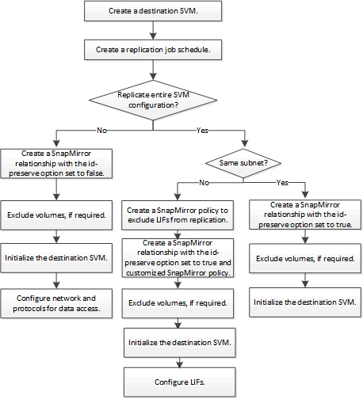

= Workflow di replica di SnapMirror SVM
:allow-uri-read: 
:icons: font
:imagesdir: ../media/

[role="lead"]
La replica di SnapMirror SVM implica la creazione della SVM di destinazione, la creazione di una pianificazione dei processi di replica e la creazione e l'inizializzazione di una relazione SnapMirror.

[NOTE]
====
Questo flusso di lavoro presuppone che si stia già utilizzando un criterio predefinito o un criterio di replica personalizzato.

====

