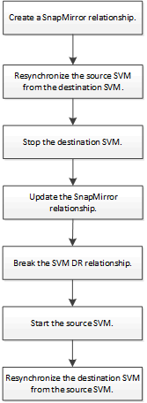

= Workflow di riattivazione SVM di origine
:allow-uri-read: 
:icons: font
:imagesdir: ../media/

[role="lead"]
Se la SVM di origine esiste dopo un disastro, è possibile riattivarla e proteggerla ricreando la relazione di disaster recovery di SVM.

