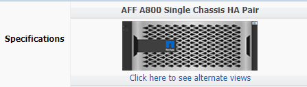

= Aggiungere dischi a un nodo o a uno shelf
:allow-uri-read: 
:icons: font

[role="lead"]
È possibile aggiungere dischi a un nodo o a uno shelf per aumentare il numero di hot spare o aggiungere spazio al Tier locale (aggregato).

.Prima di iniziare
L'unità che si desidera aggiungere deve essere supportata dalla piattaforma. È possibile confermare utilizzando link:https://hwu.netapp.com/["NetApp Hardware Universe"^].

Il numero minimo di dischi da aggiungere in una singola procedura è sei. L'aggiunta di un singolo disco potrebbe ridurre le prestazioni.

.Procedura per l'NetApp Hardware Universe
. Nel menu a discesa **prodotti**, selezionare la configurazione hardware
. Selezionare la piattaforma.
. Selezionare la versione di ONTAP che si sta eseguendo quindi **Mostra risultati**.
. Sotto l'immagine, selezionare **fare clic qui per visualizzare le viste alternative**. Scegliere la visualizzazione corrispondente alla configurazione.

.Procedura per l'installazione delle unità
. Controllare link:https://mysupport.netapp.com/site/["Sito di supporto NetApp"^] Per firmware di dischi e shelf più recenti e file di Disk Qualification Package.
+
Se il nodo o lo shelf non dispone delle versioni più recenti, aggiornarle prima di installare il nuovo disco.

+
Il firmware del disco viene aggiornato automaticamente (senza interruzioni) sui nuovi dischi che non dispongono delle versioni firmware correnti.

. Mettere a terra l'utente.
. Rimuovere delicatamente il pannello frontale dalla parte anteriore della piattaforma.
. Identificare lo slot corretto per il nuovo disco.
+

NOTE: Gli slot corretti per l'aggiunta di dischi variano a seconda del modello di piattaforma e della versione di ONTAP. In alcuni casi è necessario aggiungere unità a slot specifici in sequenza. Ad esempio, in un AFF A800 si aggiungono i dischi a intervalli specifici lasciando cluster di slot vuoti. Mentre in un AFF A220 si aggiungono nuove unità ai successivi slot vuoti che vanno dall'esterno verso il centro dello shelf.

+
Fare riferimento alla procedura descritta in **prima di iniziare** per identificare gli slot corretti per la configurazione in uso in link:https://hwu.netapp.com/["NetApp Hardware Universe"^].

. Inserire il nuovo disco:
+
.. Con la maniglia della camma in posizione aperta, inserire il nuovo disco con entrambe le mani.
.. Premere fino all'arresto del disco.
.. Chiudere la maniglia della camma in modo che l'unità sia completamente inserita nel piano intermedio e la maniglia scatti in posizione. Chiudere lentamente la maniglia della camma in modo che sia allineata correttamente con la superficie dell'unità.

. Verificare che il LED di attività del disco (verde) sia acceso.
+
Quando il LED di attività del disco è acceso, significa che il disco è alimentato. Quando il LED di attività del disco lampeggia, significa che il disco è alimentato e che l'i/o è in corso. Se il firmware del disco viene aggiornato automaticamente, il LED lampeggia.

. Per aggiungere un'altra unità, ripetere i passaggi da 4 a 6.
+
I nuovi dischi non vengono riconosciuti fino a quando non vengono assegnati a un nodo. È possibile assegnare i nuovi dischi manualmente oppure attendere che ONTAP assegni automaticamente i nuovi dischi se il nodo segue le regole per l'assegnazione automatica dei dischi.

. Una volta riconosciuti tutti i nuovi dischi, verificare che siano stati aggiunti e che la proprietà sia specificata correttamente.

.Procedura per confermare l'installazione
. Visualizzare l'elenco dei dischi:
+
`storage aggregate show-spare-disks`

+
Dovrebbero essere visualizzati i nuovi dischi, di proprietà del nodo corretto.

. **Facoltativamente (solo per ONTAP 9,3 e versioni precedenti),** azzerare le unità appena aggiunte:
+
`storage disk zerospares`

+
I dischi utilizzati in precedenza in un Tier locale (aggregato) ONTAP devono essere azzerati prima di poter essere aggiunti a un altro aggregato. In ONTAP 9.3 e versioni precedenti, il completamento dell'azzeramento può richiedere ore, a seconda delle dimensioni dei dischi non azzerati nel nodo. L'azzeramento dei dischi consente di evitare ritardi nel caso in cui sia necessario aumentare rapidamente le dimensioni di un Tier locale. Questo non è un problema in ONTAP 9.4 o versioni successive, in cui i dischi vengono azzerati utilizzando _l'azzeramento rapido_ che richiede solo secondi.

.Risultati
I nuovi dischi sono pronti. È possibile aggiungerli a un Tier locale (aggregato), inserirli nell'elenco delle hot spare o aggiungerli quando si crea un nuovo Tier locale.
