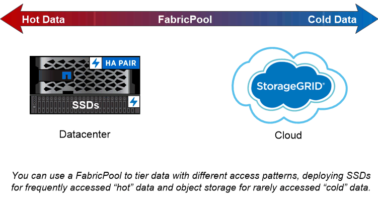

= Panoramica su dischi e Tier locali (aggregati)
:allow-uri-read: 
:icons: font
:imagesdir: ../media/

[role="lead"]
È possibile gestire lo storage fisico di ONTAP utilizzando Gestione di sistema e l'interfaccia CLI. È possibile creare, espandere e gestire i Tier locali (aggregati), lavorare con i Tier locali di Flash Pool (aggregati), gestire i dischi e gestire le policy RAID.

== Quali sono i Tier locali (aggregati)

_Tier locali_ (denominati anche _aggregati_) sono contenitori per i dischi gestiti da un nodo. È possibile utilizzare i Tier locali per isolare i carichi di lavoro con esigenze di performance diverse, per tierare i dati con diversi modelli di accesso o per separare i dati per scopi normativi.

* Per le applicazioni business-critical che richiedono la latenza più bassa possibile e le performance più elevate, è possibile creare un Tier locale composto interamente da SSD.
* Per tierare i dati con diversi modelli di accesso, è possibile creare un _Tier locale ibrido_, implementando la flash come cache dalle performance elevate per un set di dati funzionante, utilizzando al contempo HDD a basso costo o storage a oggetti per i dati ad accesso meno frequente.
+
** Un _Flash Pool_ è costituito da SSD e HDD.
** Un _FabricPool_ è costituito da un Tier locale all-SSD con un archivio di oggetti collegato.

* Se è necessario separare i dati archiviati dai dati attivi per scopi normativi, è possibile utilizzare un Tier locale costituito da HDD con capacità o una combinazione di HDD con capacità e performance.

== Lavorare con i Tier locali (aggregati)

È possibile eseguire le seguenti operazioni:

* link:manage-local-tiers-overview-concept.html["Gestire i Tier locali (aggregati)"]
* link:manage-disks-overview-concept.html["Gestire i dischi"]
* link:manage-raid-configs-overview-concept.html["Gestire le configurazioni RAID"]
* link:manage-flash-pool-tiers-overview-concept.html["Gestire i Tier di Flash Pool"]

Eseguire queste attività se si verificano le seguenti condizioni:

* Non si desidera utilizzare uno strumento di scripting automatico.
* Si desidera utilizzare le Best practice, non esplorare tutte le opzioni disponibili.
* Si dispone di una configurazione MetroCluster e si stanno seguendo le procedure descritte in link:https://docs.netapp.com/us-en/ontap-metrocluster["MetroCluster"^] documentazione per la configurazione iniziale e linee guida per tier locali (aggregati) e gestione dei dischi.

.Informazioni correlate
* link:../fabricpool/index.html["Gestire i Tier cloud FabricPool"]

