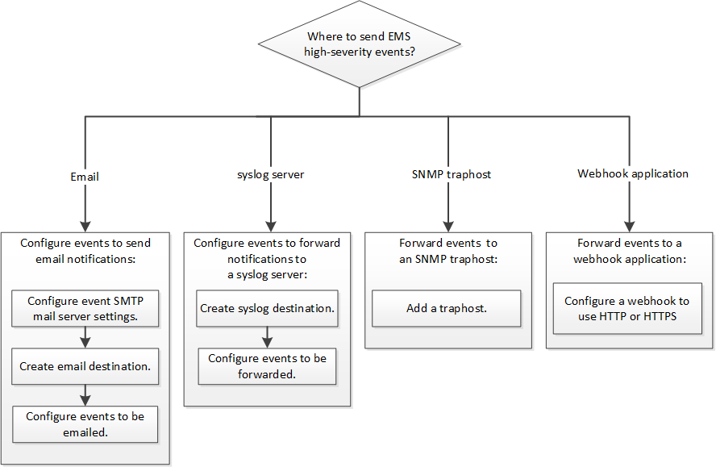

= Workflow di configurazione EMS
:allow-uri-read: 
:icons: font
:imagesdir: ../media/

[role="lead"]
È necessario configurare le notifiche di eventi EMS importanti da inviare come email, inoltrate a un server syslog, inoltrate a un host traphost SNMP o inoltrate a un'applicazione webhook. In questo modo, è possibile evitare interruzioni del sistema adottando azioni correttive in modo tempestivo.

.A proposito di questa attività
Se l'ambiente in uso contiene già un server syslog per l'aggregazione degli eventi registrati da altri sistemi, come server e applicazioni, è più semplice utilizzare tale server syslog anche per le notifiche di eventi importanti provenienti dai sistemi storage.

Se l'ambiente non contiene già un server syslog, è più semplice utilizzare l'e-mail per le notifiche di eventi importanti.

Se si inoltrano già notifiche di eventi a un host trapSNMP, potrebbe essere necessario monitorare tale host per rilevare eventi importanti.

.Scelte
* Impostare EMS per l'invio delle notifiche degli eventi.
+
|===

| Se vuoi... | Fare riferimento a... 

 a| 
EMS per inviare notifiche di eventi importanti a un indirizzo e-mail
 a| 
xref:configure-ems-events-send-email-task.adoc[Configurare eventi EMS importanti per l'invio di notifiche e-mail]

 a| 
EMS per inoltrare notifiche di eventi importanti a un server syslog
 a| 
xref:configure-ems-events-notifications-syslog-task.adoc[Configurare eventi EMS importanti per inoltrare le notifiche a un server syslog]

 a| 
Se si desidera che EMS inoltri le notifiche degli eventi a un host trapSNMP
 a| 
xref:configure-snmp-traphosts-event-notifications-task.adoc[Configurare i traphost SNMP per ricevere le notifiche degli eventi]

 a| 
Se si desidera che EMS inoltri le notifiche degli eventi a un'applicazione webhook
 a| 
xref:configure-webhooks-event-notifications-task.adoc[Configurare eventi EMS importanti per inoltrare le notifiche a un'applicazione webhook]

|===

