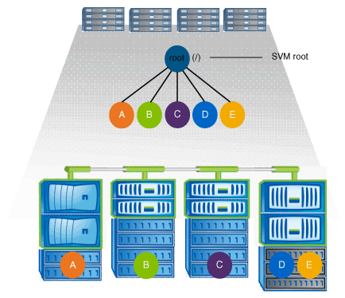

= Quali sono le tipiche architetture dello spazio dei nomi NAS
:allow-uri-read: 
:icons: font
:imagesdir: ../media/

[role="lead"]
Esistono diverse architetture dello spazio dei nomi NAS tipiche che è possibile utilizzare per creare lo spazio dei nomi SVM. È possibile scegliere l'architettura dello spazio dei nomi che soddisfa le esigenze di business e workflow.

La parte superiore dello spazio dei nomi è sempre il volume root, rappresentato da una barra (/). L'architettura dello spazio dei nomi sotto la radice si suddivide in tre categorie di base:

* Un singolo albero ramificato, con una sola giunzione alla radice dello spazio dei nomi
* Più alberi ramificati, con più punti di giunzione alla radice dello spazio dei nomi
* Più volumi standalone, ciascuno con un punto di giunzione separato per la radice dello spazio dei nomi

== Namespace con singolo albero ramificato

Un'architettura con un singolo albero ramificato ha un singolo punto di inserimento alla radice dello spazio dei nomi SVM. Il singolo punto di inserimento può essere un volume giuntato o una directory sotto la root. Tutti gli altri volumi vengono montati nei punti di giunzione sotto il singolo punto di inserimento (che può essere un volume o una directory).

image::../media/namespace-architecture-with-single-branched-tree.gif[Namespace con singolo albero ramificato]

Ad esempio, una configurazione tipica di giunzione di volumi con l'architettura dello spazio dei nomi sopra descritta potrebbe essere simile alla seguente configurazione, in cui tutti i volumi sono congiunti sotto il singolo punto di inserimento, che è una directory denominata "`data`":

[listing]
----

                     Junction                       Junction
Vserver Volume       Active   Junction Path         Path Source
------- ------------ -------- -------------------   -----------
vs1     corp1        true     /data/dir1/corp1      RW_volume
vs1     corp2        true     /data/dir1/corp2      RW_volume
vs1     data1        true     /data/data1           RW_volume
vs1     eng1         true     /data/data1/eng1      RW_volume
vs1     eng2         true     /data/data1/eng2      RW_volume
vs1     sales        true     /data/data1/sales     RW_volume
vs1     vol1         true     /data/vol1            RW_volume
vs1     vol2         true     /data/vol2            RW_volume
vs1     vol3         true     /data/vol3            RW_volume
vs1     vs1_root     -        /                     -
----

== Namespace con più alberi ramificati

Un'architettura con più alberi ramificati ha più punti di inserimento alla radice dello spazio dei nomi SVM. I punti di inserimento possono essere volumi congiunti o directory sotto la radice. Tutti gli altri volumi vengono montati nei punti di giunzione sotto i punti di inserimento (che possono essere volumi o directory).

image::../media/namespace-architecture-with-multiple-branched-trees.png[Namespace con più alberi ramificati]

Ad esempio, una configurazione tipica di giunzione del volume con l'architettura dello spazio dei nomi di cui sopra potrebbe essere simile alla seguente configurazione, in cui sono presenti tre punti di inserimento nel volume root della SVM. Due punti di inserimento sono directory denominate "`data`" e "`projects`". Un punto di inserimento è un volume giuntato denominato "`audit`":

[listing]
----

                     Junction                       Junction
Vserver Volume       Active   Junction Path         Path Source
------- ------------ -------- -------------------   -----------
vs1     audit        true     /audit                RW_volume
vs1     audit_logs1  true     /audit/logs1          RW_volume
vs1     audit_logs2  true     /audit/logs2          RW_volume
vs1     audit_logs3  true     /audit/logs3          RW_volume
vs1     eng          true     /data/eng             RW_volume
vs1     mktg1        true     /data/mktg1           RW_volume
vs1     mktg2        true     /data/mktg2           RW_volume
vs1     project1     true     /projects/project1    RW_volume
vs1     project2     true     /projects/project2    RW_volume
vs1     vs1_root     -        /                     -
----

== Namespace con più volumi standalone

In un'architettura con volumi standalone, ogni volume ha un punto di inserimento nella directory principale dello spazio dei nomi SVM; tuttavia, il volume non è giuntato sotto un altro volume. Ogni volume ha un percorso univoco ed è posto direttamente sotto la root oppure è posto sotto una directory sotto la root.

Ad esempio, una configurazione tipica di giunzione del volume con l'architettura dello spazio dei nomi di cui sopra potrebbe essere simile alla seguente configurazione, in cui sono presenti cinque punti di inserimento nel volume root della SVM, con ciascun punto di inserimento che rappresenta un percorso per un volume.

[listing]
----

                     Junction                       Junction
Vserver Volume       Active   Junction Path         Path Source
------- ------------ -------- -------------------   -----------
vs1     eng          true     /eng                  RW_volume
vs1     mktg         true     /vol/mktg             RW_volume
vs1     project1     true     /project1             RW_volume
vs1     project2     true     /project2             RW_volume
vs1     sales        true     /sales                RW_volume
vs1     vs1_root     -        /                     -
----