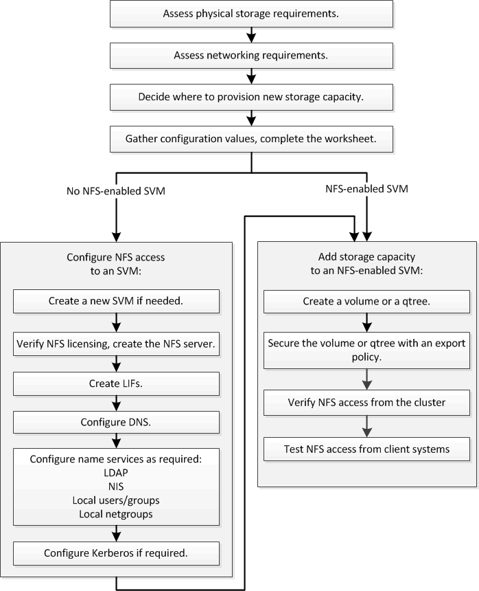

= Workflow di configurazione NFS
:allow-uri-read: 
:icons: font
:imagesdir: ../media/

[role="lead"]
La configurazione di NFS implica la valutazione dei requisiti di storage fisico e di rete e la scelta di un workflow specifico per il tuo obiettivo: Configurare l'accesso NFS a una SVM nuova o esistente oppure aggiungere un volume o qtree a una SVM esistente già completamente configurata per l'accesso NFS.

