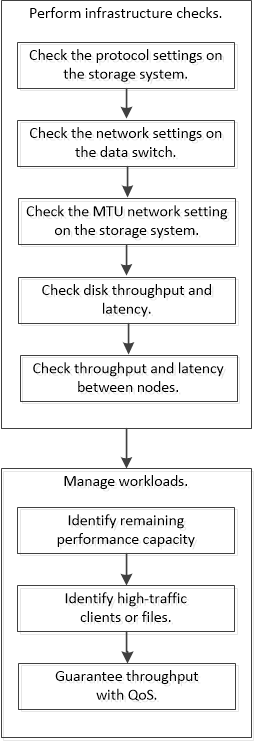

= Workflow di gestione delle performance
:allow-uri-read: 
:icons: font
:imagesdir: ../media/

[role="lead"]
Una volta identificato un problema di performance, è possibile eseguire alcuni controlli diagnostici di base dell'infrastruttura per escludere errori di configurazione evidenti. Se questi non individuano il problema, è possibile iniziare a esaminare i problemi di gestione del carico di lavoro.

