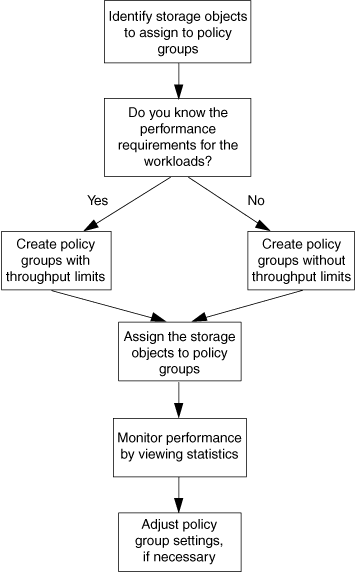

= Workflow di QoS dello storage
:allow-uri-read: 
:icons: font
:imagesdir: ../media/

[role="lead"]
Se si conoscono già i requisiti di performance per i carichi di lavoro che si desidera gestire con QoS, è possibile specificare il limite di throughput quando si crea il gruppo di policy. In caso contrario, è possibile attendere fino a quando non si monitorano i carichi di lavoro per specificare il limite.

