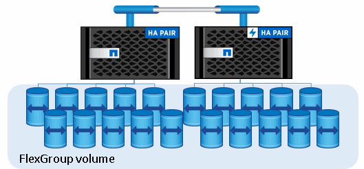

= Architettura e casi di utilizzo di ONTAP S3
:allow-uri-read: 
:icons: font
:imagesdir: ../media/

[role="lead"]
In ONTAP, l'architettura sottostante per un bucket è un volume FlexGroup, ovvero un singolo namespace costituito da più volumi membri costituenti, ma gestito come un singolo volume.

I bucket sono limitati solo dai massimi fisici dell'hardware sottostante e i massimi architettonici potrebbero essere più elevati. I bucket possono sfruttare il dimensionamento elastico di FlexGroup per far crescere automaticamente un componente di un volume FlexGroup se lo spazio è esaurito. Esiste un limite di 1000 bucket per volume FlexGroup o di 1/3 della capacità del volume FlexGroup (per tenere conto della crescita dei dati nei bucket).

[NOTE]
====
Non è consentito l'accesso al protocollo NAS o SAN al volume FlexGroup che contiene bucket S3.

====
L'accesso al bucket viene fornito tramite utenti autorizzati e applicazioni client.

image::../media/s3-svm-layout.png[layout svm s3]

Esistono tre casi di utilizzo principali per l'accesso client ai servizi ONTAP S3:

* Per i sistemi ONTAP che utilizzano ONTAP S3 come Tier di capacità FabricPool remota (cloud)
+
Il server S3 e il bucket contenente il Tier di capacità (per _cold_ dati) si trovano su un cluster diverso dal Tier di performance (per _hot_ dati).

* Per i sistemi ONTAP che utilizzano ONTAP S3 come Tier FabricPool locale
+
Il server S3 e il bucket contenente il Tier di capacità si trovano sullo stesso cluster, ma su una coppia ha diversa, come il Tier di performance.

* Per applicazioni client S3 esterne
+
ONTAP S3 serve applicazioni client S3 eseguite su sistemi non NetApp.

È consigliabile fornire l'accesso ai bucket ONTAP S3 utilizzando HTTPS. Quando HTTPS è attivato, i certificati di sicurezza sono necessari per la corretta integrazione con SSL/TLS. Gli utenti client`' devono quindi autenticare l'utente con ONTAP S3 e autorizzare le autorizzazioni di accesso degli utenti` per le operazioni in ONTAP S3. L'applicazione client deve anche avere accesso al certificato CA principale (certificato firmato dal server ONTAP S3) per poter autenticare il server e creare una connessione sicura tra client e server.

Gli utenti vengono creati all'interno della SVM abilitata per S3 e le relative autorizzazioni di accesso possono essere controllate a livello di bucket o SVM, ovvero possono avere accesso a uno o più bucket all'interno della SVM.

HTTPS è attivato per impostazione predefinita sui server ONTAP S3. È possibile disattivare HTTPS e attivare HTTP per l'accesso al client, nel qual caso non è richiesta l'autenticazione mediante certificati CA. Tuttavia, quando HTTP è attivato e HTTPS è disattivato, tutte le comunicazioni con il server ONTAP S3 vengono inviate sulla rete in testo non crittografato.

Per ulteriori informazioni, vedere https://www.netapp.com/pdf.html?item=/media/17219-tr4814pdf.pdf["Report tecnico: Le Best practice S3 in ONTAP"]

.Informazioni correlate
link:../flexgroup/index.html["Gestione dei volumi FlexGroup"]
