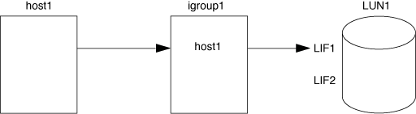

= Metodi per limitare l'accesso LUN con portset e igroups
:allow-uri-read: 
:icons: font
:imagesdir: ../media/

[role="lead"]
Oltre a utilizzare la mappa LUN selettiva (SLM), è possibile limitare l'accesso ai LUN tramite igroups e portset.

I portset possono essere utilizzati con SLM per limitare ulteriormente l'accesso di determinate destinazioni a determinati iniziatori. Quando si utilizza SLM con i portset, i LUN saranno accessibili sull'insieme di LIF nel portset sul nodo che possiede il LUN e sul partner ha di quel nodo.

Nell'esempio seguente, initator1 non ha un portset. Senza un portset, l'iniziator1 può accedere a LUN1 tramite LIF e LISF2.

È possibile limitare l'accesso a LUN1 utilizzando un portset. Nell'esempio seguente, l'iniziator1 può accedere a LUN1 solo tramite LIF. Tuttavia, l'iniziator1 non può accedere a LUN1 tramite LISF2 perché LISF2 non si trova in portset1.

image::../media/bsag-c-mode-portset.gif[Immagine che mostra l'accesso del LUN mediante una porta et]

.Informazioni correlate
* xref:selective-lun-map-concept.adoc[Mappa LUN selettiva]
* xref:create-port-sets-binding-igroups-task.adoc[Creare un portset e associarlo a un igroup]

