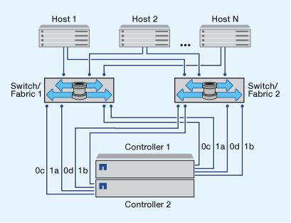

= Modalità di configurazione degli host SAN FC & FC-NVMe
:allow-uri-read: 
:icons: font
:imagesdir: ../media/

[role="lead"]
Si consiglia di configurare gli host SAN FC e FC-NVMe utilizzando coppie ha e un minimo di due switch.  Questo garantisce ridondanza a livello di fabric e di sistema storage per supportare la tolleranza agli errori e le operazioni senza interruzioni. Non è possibile collegare direttamente host FC o FC-NVMe SAN a coppie ha senza utilizzare uno switch.

Cascade, Partial Mesh, full mesh, core-edge e director fabric sono tutti metodi standard di settore per collegare switch FC a un fabric e sono tutti supportati.  L'utilizzo di fabric switch FC eterogenei non è supportato, tranne nel caso di switch blade integrati.  Le eccezioni specifiche sono elencate nella link:https://imt.netapp.com/matrix/["Tool di matrice di interoperabilità"^].  Un fabric può essere costituito da uno o più switch e i controller di storage possono essere collegati a più switch.

Più host, utilizzando sistemi operativi diversi, come Windows, Linux o UNIX, possono accedere contemporaneamente ai controller di storage.  Gli host richiedono l'installazione e la configurazione di una soluzione multipathing supportata. È possibile verificare i sistemi operativi e le soluzioni multipathing supportate tramite Interoperability Matrix Tool.

== Configurazioni FC e FC-NVMe multi-fabric

Nelle configurazioni ha Pair multi-fabric, sono presenti due o più switch che collegano coppie ha a uno o più host. Per semplicità, la seguente figura di coppia ha multi-fabric mostra solo due fabric, ma puoi avere due o più fabric in qualsiasi configurazione multi-fabric.

I numeri delle porte di destinazione FC (0C, 0d, 1a, 1b) nelle illustrazioni sono esempi. I numeri di porta effettivi variano a seconda del modello del nodo di storage e dell'utilizzo di adattatori di espansione.

== Configurazioni FC e FC-NVMe single-fabric

Nelle configurazioni a coppia ha a fabric singolo, esiste un fabric che collega entrambi i controller della coppia ha a uno o più host. Poiché gli host e i controller sono connessi tramite un singolo switch, le configurazioni ha Pair single-fabric non sono completamente ridondanti.

I numeri delle porte di destinazione FC (0A, 0C) nelle illustrazioni sono esempi. I numeri di porta effettivi variano a seconda del modello del nodo di storage e dell'utilizzo di adattatori di espansione.

Tutte le piattaforme che supportano le configurazioni FC supportano le configurazioni ha Pair single-fabric.

image::../media/scrn_en_drw_fc-62xx-single-HA.png[Diagramma di coppia ha fabric a switch singolo]

[NOTE]
====
link:../system-admin/single-node-clusters.html["Configurazioni a nodo singolo"] sono sconsigliati perché non forniscono la ridondanza necessaria per supportare la tolleranza agli errori e le operazioni senza interruzioni.

====
.Informazioni correlate
* Scopri come link:../san-admin/selective-lun-map-concept.html#determine-whether-slm-is-enabled-on-a-lun-map["Mappatura selettiva delle LUN (SLM)"] Limita i percorsi utilizzati per accedere alle LUN di proprietà di una coppia ha.
* Scopri di più link:../san-admin/manage-lifs-all-san-protocols-concept.html["LIF SAN"].

