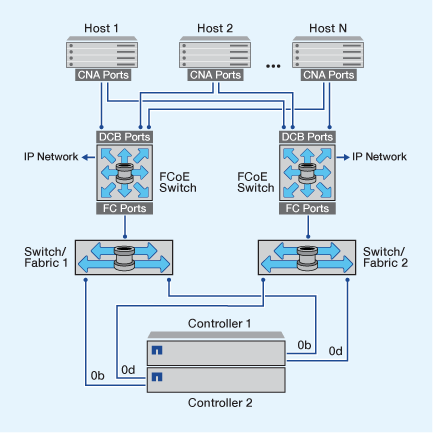
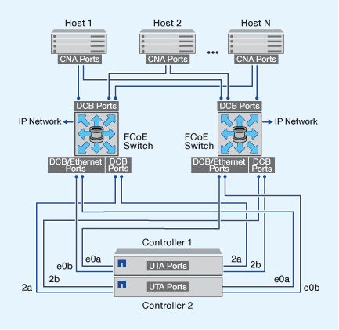

= Panoramica su come configurare FCoE
:allow-uri-read: 
:icons: font
:imagesdir: ../media/

[role="lead"]
FCoE può essere configurato in vari modi utilizzando gli switch FCoE. Le configurazioni direct-attached non sono supportate in FCoE.

Tutte le configurazioni FCoE sono dual-fabric, completamente ridondanti e richiedono software di multipathing lato host. In tutte le configurazioni FCoE, è possibile disporre di più switch FCoE e FC nel percorso tra l'iniziatore e la destinazione, fino al limite massimo del numero di hop. Per collegare gli switch tra loro, è necessario che gli switch eseguano una versione del firmware che supporti gli ISL Ethernet. Ogni host in qualsiasi configurazione FCoE può essere configurato con un sistema operativo diverso.

Le configurazioni FCoE richiedono switch Ethernet che supportano esplicitamente le funzionalità FCoE. Le configurazioni FCoE vengono validate attraverso lo stesso processo di interoperabilità e di garanzia della qualità degli switch FC. Le configurazioni supportate sono elencate nella matrice di interoperabilità. Alcuni dei parametri inclusi in queste configurazioni supportate sono il modello di switch, il numero di switch implementabili in un singolo fabric e la versione del firmware dello switch supportata.

I numeri delle porte dell'adattatore di espansione FC target nelle illustrazioni sono esempi. I numeri effettivi delle porte possono variare a seconda degli slot di espansione in cui sono installati gli adattatori di espansione di destinazione FCoE.

== Iniziatore FCoE su destinazione FC

Utilizzando gli iniziatori FCoE (CNA), è possibile collegare gli host a entrambi i controller in una coppia ha attraverso gli switch FCoE alle porte di destinazione FC. Lo switch FCoE deve anche disporre di porte FC. L'iniziatore FCoE host si connette sempre allo switch FCoE. Lo switch FCoE può connettersi direttamente alla destinazione FC o alla destinazione FC tramite switch FC.

La figura seguente mostra i CNA host che si collegano a uno switch FCoE e quindi a uno switch FC prima di connettersi alla coppia ha:

== Iniziatore FCoE alla destinazione FCoE

Utilizzando gli iniziatori host FCoE (CNA), è possibile collegare gli host a entrambi i controller in una coppia ha alle porte di destinazione FCoE (chiamate anche UTAS o UTA2s) attraverso gli switch FCoE.

image::../media/scrn_en_drw_fcoe-end-to-end.png[Iniziatore FCoE alla destinazione FCoE]

== Iniziatore FCoE per destinazioni FCoE e FC

Utilizzando gli iniziatori host FCoE (CNA), è possibile collegare gli host a entrambi i controller in una coppia ha alle porte di destinazione FCoE e FC (chiamate anche UTAS o UTA2s) attraverso gli switch FCoE.

image::../media/scrn_en_drw_fcoe-mixed.png[Iniziatore FCoE per destinazioni FCoE e FC]

== FCoE combinato con i protocolli di storage IP

Utilizzando gli iniziatori host FCoE (CNA), è possibile collegare gli host a entrambi i controller in una coppia ha alle porte di destinazione FCoE (chiamate anche UTAS o UTA2s) attraverso gli switch FCoE. Le porte FCoE non possono utilizzare l'aggregazione di collegamenti tradizionale per un singolo switch. Gli switch Cisco supportano un tipo speciale di aggregazione di collegamenti (Virtual Port Channel) che supporta FCoE. Un Virtual Port Channel aggrega i singoli collegamenti a due switch. È inoltre possibile utilizzare Virtual Port Channels per altri tipi di traffico Ethernet. Le porte utilizzate per il traffico diverso da FCoE, tra cui NFS, SMB, iSCSI e altro traffico Ethernet, possono utilizzare le normali porte Ethernet degli switch FCoE.

