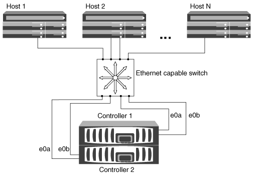

= Modi per configurare host SAN iSCSI con coppie ha
:allow-uri-read: 
:icons: font
:imagesdir: ../media/

[role="lead"]
È possibile configurare gli host SAN iSCSI per la connessione a configurazioni a nodo doppio o a nodo multiplo utilizzando uno o più switch IP. È necessario determinare se si desidera una configurazione a singolo switch non completamente ridondante o una configurazione a più switch completamente ridondante.

È possibile configurare host SAN iSCSI con singoli controller e coppie ha su ambienti direct-attached, single-network o multi-network. Le coppie HA possono avere più connessioni iSCSI per ogni switch, ma su ogni host è richiesto un software multipathing che supporti ALUA. Se sono presenti più host, è possibile configurare ciascun host con un sistema operativo diverso selezionando NetAppInteroperability Matrix Tool.

https://mysupport.netapp.com/matrix["Tool di matrice di interoperabilità NetApp"^]

== Collegamento diretto

In una configurazione direct-attached, uno o più host sono collegati direttamente ai controller.

image::../media/dual-host-dual-controller.gif[Configurazione diretta degli allegati]

== Coppie ha a rete singola

Nelle configurazioni a coppia ha a rete singola, uno switch connette la coppia ha a uno o più host. Poiché esiste un singolo switch, questa configurazione non è completamente ridondante.

== Coppie ha multi-rete

Nelle configurazioni di coppia ha multi-rete, due o più switch connettono la coppia ha a uno o più host. Poiché esistono più switch, questa configurazione è completamente ridondante.

image::../media/scrn-en-drw-iscsi-dual.gif[Configurazione della coppia ha multi-network]
