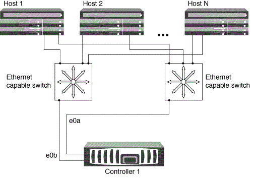

= Modi per configurare host SAN iSCSI con nodi singoli
:allow-uri-read: 
:icons: font
:imagesdir: ../media/

[role="lead"]
È possibile configurare gli host SAN iSCSI in modo che si connettano direttamente a un singolo nodo o utilizzando uno o più switch IP. È necessario determinare se si desidera una configurazione a singolo switch non completamente ridondante o una configurazione a più switch completamente ridondante.

È possibile configurare gli host SAN iSCSI in un ambiente direct-attached, single-switch o multi-switch. Se ci sono più host che si connettono al nodo, ciascun host può essere configurato con un sistema operativo diverso. Per le configurazioni a una o più reti, il nodo può avere più connessioni iSCSI allo switch, ma è necessario un software multipathing che supporti ALUA.

[NOTE]
====
Se sono presenti più percorsi dall'host al controller, ALUA deve essere abilitato sull'host.

====

== Configurazioni a nodo singolo direct-attached

Nelle configurazioni direct-attached, uno o più host sono collegati direttamente al nodo.

image::../media/scrn_en_drw_fc-302020-direct-sing-on.png[diagramma dei controller collegati direttamente con uno o più host collegati direttamente al nodo]

== Configurazioni a nodo singolo di rete

Nelle configurazioni a nodo singolo di rete, uno switch connette un singolo nodo a uno o più host. Poiché esiste un singolo switch, questa configurazione non è completamente ridondante.

image::../media/r-oc-set-iscsi-singlenetwork-singlenode.gif[r oc imposta il singlenetwork di iscsi]

== Configurazioni multi-rete a nodo singolo

Nelle configurazioni multi-network a nodo singolo, due o più switch collegano un singolo nodo a uno o più host. Poiché esistono più switch, questa configurazione è completamente ridondante.

