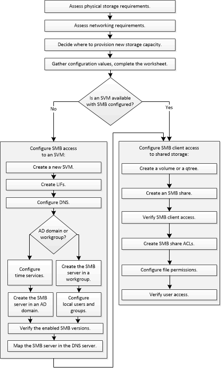

= Workflow di configurazione SMB
:allow-uri-read: 
:icons: font
:imagesdir: ../media/

[role="lead"]
La configurazione di SMB implica la valutazione dei requisiti di storage fisico e di rete, quindi la scelta di un workflow specifico dell'obiettivo, la configurazione dell'accesso SMB a una SVM nuova o esistente o l'aggiunta di un volume o qtree a una SVM esistente già completamente configurata per l'accesso SMB.

