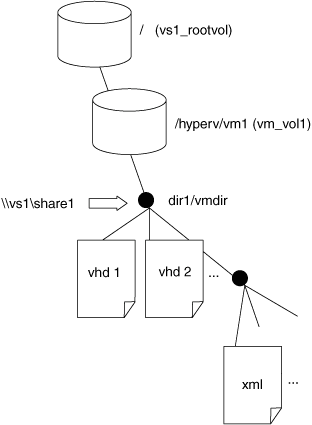

= Esempio di struttura di directory utilizzata da Remote VSS
:allow-uri-read: 
:icons: font
:imagesdir: ../media/

[role="lead"]
Il VSS remoto attraversa la struttura di directory che memorizza i file delle macchine virtuali Hyper-V durante la creazione di copie shadow. È importante capire quale sia la struttura di directory appropriata, in modo da poter creare correttamente i backup dei file delle macchine virtuali.

Una struttura di directory supportata per la creazione di copie shadow è conforme ai seguenti requisiti:

* Solo le directory e i file regolari sono presenti all'interno della struttura di directory utilizzata per memorizzare i file delle macchine virtuali.
+
La struttura di directory non contiene giunzioni, collegamenti o file non regolari.

* Tutti i file di una macchina virtuale risiedono all'interno di una singola condivisione.
* La struttura di directory utilizzata per memorizzare i file delle macchine virtuali non supera la profondità configurata della directory di copia shadow.
* La directory principale della condivisione contiene solo i file o le directory delle macchine virtuali.

Nella seguente illustrazione, il volume denominato vm_vol1 viene creato con un punto di giunzione in `/hyperv/vm1` Su storage virtual machine (SVM) vs1. Le sottodirectory che contengono i file della macchina virtuale vengono create sotto il punto di giunzione. Ai file della macchina virtuale del server Hyper-V si accede tramite share1 che ha il percorso `/hyperv/vm1/dir1/vmdir`. Il servizio di copia shadow crea copie shadow di tutti i file della macchina virtuale contenuti nella struttura di directory sotto share1 (fino alla profondità configurata della directory di copia shadow).

