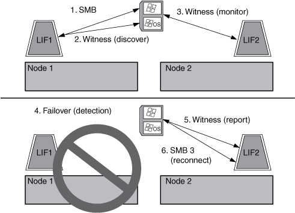

= Funzionamento del protocollo Witness
:allow-uri-read: 
:icons: font
:imagesdir: ../media/

[role="lead"]
ONTAP implementa il protocollo Witness utilizzando il partner SFO di un nodo come Witness. In caso di guasto, il partner rileva rapidamente il guasto e notifica il client SMB.

Il protocollo Witness offre un failover avanzato utilizzando il seguente processo:

. Quando l'application server stabilisce una connessione SMB continuamente disponibile al Node1, il server CIFS informa l'application server che il server di controllo è disponibile.
. Il server applicazioni richiede gli indirizzi IP del server di controllo del mirroring dal Node1 e riceve un elenco di indirizzi IP LIF dei dati Node2 (il partner SFO) assegnati alla macchina virtuale di storage (SVM).
. Il server applicazioni sceglie uno degli indirizzi IP, crea una connessione testimone a Node2 e registra per ricevere una notifica se la connessione continuamente disponibile su Node1 deve spostarsi.
. Se si verifica un evento di failover su Node1, Witness facilita gli eventi di failover, ma non è coinvolto nel giveback.
. Il server di controllo del mirroring rileva l'evento di failover e notifica al server applicazioni tramite la connessione di controllo del mirroring che la connessione SMB deve spostarsi su Node2.
. L'application server sposta la sessione SMB su Node2 e ripristina la connessione senza interrompere l'accesso al client.

